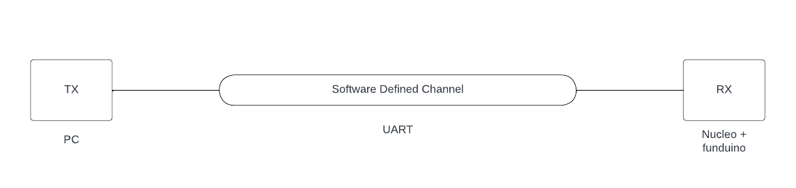
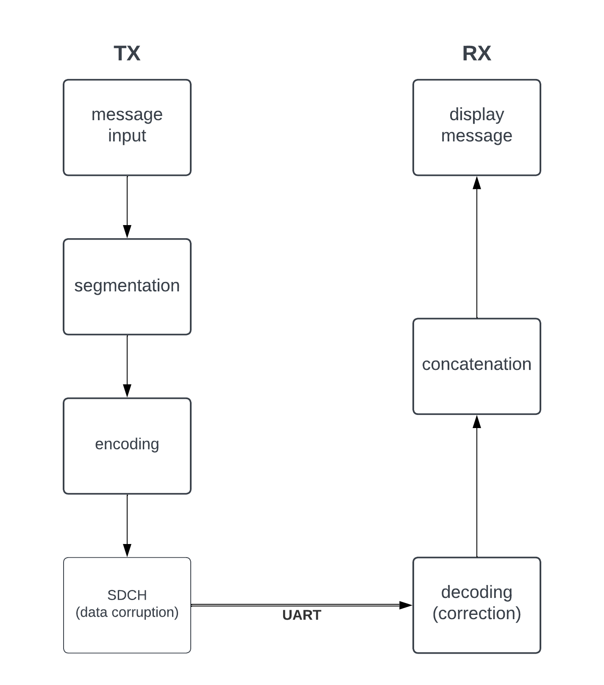

# Implementation of Correction Coding
- This project implements correction coding using Hamming code.
- 3 main components: transmitter (TX), receiver (RX), and Software Defined Channel (SDCH)
  - TX represented by PC is encoding user input message
  - SDCH, part of TX code, corrupts the data
  - RX reads the data and corrects it
  
---


</img>

Project overview diagram

---


</img>

Project flowchart

---

## 1. Theoretical background
The main principle of coding is to gain the ability to detect and, under some conditions, even correct errors. This is achieved through redundancy. There are two ways to ensure redundancy. Alphabet expansion ($M_c$) and dimension expansion ($N_c$).
To achieve redundancy, the following must hold:

$M_c^{N_c L} > M_b^{N_b L}$

That is, the set of all possible sequences in code embedding space must be larger than the number of all possible messages (datawords).

### 1.1 Linear (Systematic) Block Codes
For linear codes, the input-output relation between dataword ($\mathbf{d}$) and codeword ($\mathbf{c}$) is linear one-to-one mapping.

Block codes segment the input data into fixed-length block and then encodes these blocks independently, i.e. without memory.

**Systematic block codes** are block codes, where the dataword is a part of the codeword. The remaining part of codeword is called parity. Parity ensures redundancy and is exploited to detect and correct errors.

A generator matrix for systematic block code:

$$ \mathbf{G} = \begin{bmatrix}
\mathbf{I_\mathrm{N_b}} \\
\mathbf{P}
\end{bmatrix}$$

The codeword is then obtained like this:
$$\mathbf{c} = \mathbf{G}\mathbf{b}$$
Note that the first block of generator matrix is an identity matrix. The first $N_b$ positions of a codeword is the coded dataword.

**Hamming codes** are a subset of systematic block codes with the ability to correct all weight one errors. This project exploits Hamming (7,4) code, which takes 4-bit input dataword and encodes it with additional 3-bit parity to form a 7-bit dataword. These 7 bits are sent via UART from TX to RX.

### 1.2 Error Correction in Systematic Block Codes
Error correction exploits parity check matrix $\mathbf{H}$.

$$\mathbf{H} = \begin{bmatrix}
-\mathbf{P} \\
\mathbf{I_\mathrm{N_c - N_b}}
\end{bmatrix}$$

Parity check matrix columns form the basis of codeword null-space, orthogonal to codeword sub-space.

$$\mathbf{H^\mathrm{T}} \mathbf{G} = \mathbf{O}$$

Let's assume AWGN channel. The received codeword $\mathbf{x}$ is:
$$\mathbf{x} = \mathbf{c} + \mathbf{w}$$

To determine, if a codeword was received correctly, a **syndrome** is calculated. Syndrome is a projection of the received codeword to the sub-space orthogonal to codeword sub-space.

*Remember, that the parity check matrix describes sub-space orthogonal to codeword-subspace. Therefore, if a projection of a received code to this space is non-zero, we know that the data must have been corrupted*

$$\mathbf{s} = \mathbf{H^\mathrm{T}} \mathbf{x}$$

If the syndrome is zero, we know that a valid codeword was received. One characteristic sign of Hamming code is that it has distinct syndromes for all weight one errors, enabling correction of such errors.

### 1.3 Example Error Correction
This section examines an example of what is implemented in the code. Input data (1 Byte) is segmented into two nibbles. Each one is encoded with Hamming(7,4) code.

Lets assume an input:
```C
char message = '7'; //i.e. 0b00110111 in ASCII
```

This is, as mentioned, segmented into lower nibble and higher nibble. In the following, only lower nibble (`0x7`) encoding and decoding es shown. The 4-bit lower nibble is multiplied with the generator matrix to yield the codeword.

$$
\begin{bmatrix}
1 & 0 & 0 & 0 \\ 0 & 1 & 0 & 0 \\ 0 & 0 & 1 & 0 \\ 0 & 0 & 0 & 1 \\ 1 & 1 & 1 & 0 \\ 0 & 1 & 1 & 1 \\ 1 & 1 & 0 & 1
\end{bmatrix} \begin{bmatrix}
0 \\ 1 \\ 1 \\ 1
\end{bmatrix} = \begin{bmatrix}
0 \\ 1 \\ 1 \\ 1 \\ 0 \\ 1 \\0
\end{bmatrix}
$$


## 2. Physical layer implementation
- tx and rx connected via UART
- UART sends 8 bits of data
- segmentation and concatenation
- implementation of matrix multiplication over F body

## 3. Future work
- study linear albebra terminology to better grasp docu
- implement ARQ mechanism
